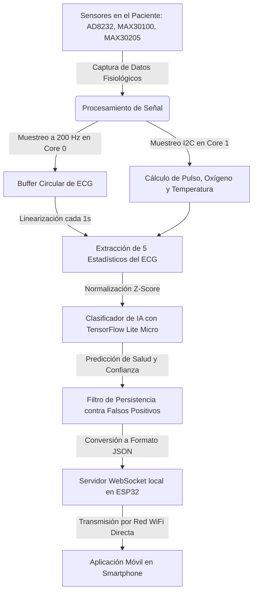

# iHealth32 — Monitoreo Inteligente de Signos Vitales en el Dispositivo

**iHealth32** es un sistema embebido experimental de salud diseñado para monitorizar los principales signos vitales de un paciente en tiempo real. Utilizando un microcontrolador ESP32 y sensores de grado médico, el dispositivo recolecta datos cardíacos y térmicos, procesa la señal en el propio aparato y utiliza una **red neuronal artificial** integrada para evaluar el estado fisiológico de la persona en segundos, sin necesidad de conectarse a internet.

Los resultados e informes se transmiten inalámbricamente a una aplicación móvil a través de una red local.

---

## ¿Cómo Funciona el Sistema? (Paso a Paso)

El funcionamiento del firmware de **iHealth32** sigue un flujo continuo de adquisición, procesamiento, clasificación y comunicación, distribuido de forma paralela en los dos núcleos del procesador ESP32:



### 1. Captura de datos (Muestreo)
El sistema obtiene constantemente información del cuerpo del paciente mediante tres sensores principales:
*   **Actividad Eléctrica Cardíaca (ECG):** Un sensor toma muestras de los impulsos eléctricos del corazón a una velocidad de **200 lecturas por segundo** (frecuencia de 200 Hz). Esta tarea se ejecuta con absoluta prioridad en el primer núcleo del procesador (**Core 0**) para garantizar que ninguna lectura se retrasase o se perdiese, lo que distorsionaría el trazo del electrocardiograma.
*   **Frecuencia Cardíaca y Oxígeno (BPM y SpO₂):** Un sensor óptico en el dedo analiza la luz absorbida por los pulsos de la sangre para calcular las pulsaciones por minuto y la saturación de oxígeno. Esta lectura se realiza en el segundo núcleo (**Core 1**).
*   **Temperatura Corporal:** Un sensor de precisión clínica lee la temperatura cutánea una vez por segundo a través de un canal de comunicación digital compartido.

### 2. Validación de Sensores
Antes de realizar cualquier análisis inteligente, el firmware evalúa si los sensores están leyendo información coherente y si los electrodos están bien colocados (detectando si los cables de ECG se han desprendido). Si los sensores detectan que el dedo no está colocado o que un electrodo se ha soltado, la inteligencia artificial se pausa automáticamente y los datos se marcan como no válidos. Esto evita emitir diagnósticos falsos basados en el aire o en el ruido eléctrico.

### 3. Procesamiento y Preparación de los Datos
Para que la inteligencia artificial pueda entender el electrocardiograma, las 200 muestras tomadas durante el último segundo se organizan cronológicamente en un bloque continuo.
Debido a que un microcontrolador tiene memoria limitada, no es eficiente enviar las 200 lecturas brutas de la señal de ECG directamente a la red neuronal. En su lugar, el firmware realiza operaciones matemáticas rápidas para resumir ese segundo de señal en **5 parámetros estadísticos clave**:
1.  **Rango (Amplitud):** La diferencia entre el punto más alto y el más bajo de la señal. Representa la fuerza del latido.
2.  **Asimetría:** Mide la falta de simetría en la forma de la onda (si el gráfico se inclina más hacia la izquierda o hacia la derecha de su centro).
3.  **Curtosis (Puntiagudeza):** Evalúa qué tan pronunciados y delgados son los picos del latido comparados con el resto de la señal.
4.  **Cruces por el Promedio:** La cantidad de veces que la línea de la señal cruza su valor medio. Ayuda a distinguir el pulso normal de oscilaciones rápidas o ruido de fondo.
5.  **Pendiente Máxima:** La velocidad de cambio más rápida que tiene la señal. Típicamente corresponde a la subida abrupta del latido del corazón (el pico del electrocardiograma).

### 4. Diagnóstico Local con Inteligencia Artificial
Los 5 parámetros obtenidos del ECG, junto con el pulso cardíaco, el oxígeno en sangre y la temperatura corporal, forman un conjunto de **8 valores de entrada**. 
*   **Normalización Z-score:** Estos 8 valores se ajustan matemáticamente utilizando promedios de referencia para que estén en el mismo rango de escala. Esto es vital, ya que la red neuronal fue entrenada bajo esta misma escala y de lo contrario no daría un resultado correcto.
*   **Evaluación (Inferencia):** El procesador ejecuta una pequeña red neuronal artificial (usando **TensorFlow Lite Micro**) que analiza el conjunto de datos y estima la probabilidad de que el paciente se encuentre en alguna de las siguientes **6 condiciones de salud**:
    *   **Clase 0: Sano** (Signos normales).
    *   **Clase 1: Fibrilación Auricular** (Un tipo de arritmia cardíaca grave).
    *   **Clase 2: Hipoxia / Apnea** (Falta crítica de oxígeno en sangre).
    *   **Clase 3: Fiebre / Infección** (Elevada temperatura corporal).
    *   **Clase 4: Taquicardia** (Frecuencia cardíaca acelerada en reposo).
    *   **Clase 5: Hipotermia** (Caída peligrosa de la temperatura corporal).

### 5. Prevención de Falsas Alarmas (Filtro de Persistencia)
Los movimientos del paciente o interferencias en el cableado pueden causar que la inteligencia artificial realice una lectura anómala aislada. Para evitar alertas innecesarias, el sistema incluye un **filtro de persistencia**: la anomalía debe ser detectada con un nivel de certeza de al menos el **70%** y mantenerse de forma ininterrumpida durante varios segundos consecutivos antes de activar una alerta real. Cada condición tiene su propio tiempo de espera según su urgencia clínica (por ejemplo, 10 segundos para arritmias o falta de oxígeno, y 20 segundos para la fiebre).

---

## ¿A Dónde y Cómo se Envían los Datos?

Una vez completado el análisis de cada segundo, el ESP32 empaqueta toda la información y la transmite de forma inalámbrica:

1.  **Punto de Acceso WiFi Propio:** El ESP32 funciona como un enrutador o "router" inalámbrico emitiendo su propia señal WiFi local con el nombre **`iHealth32`**. La aplicación móvil instalada en el smartphone del usuario se conecta directamente a esta señal de WiFi.
2.  **Canal WebSocket en Tiempo Real:** El microcontrolador levanta una línea de transmisión continua a través del protocolo **WebSocket** en la dirección `ws://192.168.4.1/ws`. A diferencia de las páginas web tradicionales (donde la aplicación tendría que preguntar constantemente si hay nuevos datos), WebSocket mantiene un canal bidireccional abierto donde el ESP32 envía información de forma constante e instantánea en cuanto está lista.
3.  **Formato JSON:** La información viaja en un formato estructurado de texto ligero llamado JSON. El mensaje tiene el siguiente aspecto y campos:

```json
{
  "ecg": 2048,
  "bpm": 72.5,
  "spo2": 98.0,
  "temp": 36.50,
  "alerta": 0,
  "conf": 0.87,
  "sensores": 1
}
```

*   **`ecg` (Número entero de 0 a 4095):** El último valor eléctrico crudo registrado del corazón. Se usa en la aplicación para dibujar la gráfica del electrocardiograma en tiempo real.
*   **`bpm` (Número decimal):** Latidos por minuto (pulso).
*   **`spo2` (Número decimal):** Saturación de oxígeno en sangre expresada en porcentaje (%).
*   **`temp` (Número decimal):** Temperatura corporal medida en grados Celsius (°C).
*   **`alerta` (Número entero de 0 a 5):** Indica la condición de salud detectada de forma estable tras el filtro de persistencia (0 representa "Sano" y del 1 al 5 corresponden a las diferentes anomalías clínicas).
*   **`conf` (Número decimal de 0.0 a 1.0):** El grado de seguridad o confianza que tiene la inteligencia artificial sobre el diagnóstico (0.87 representa un 87% de certeza).
*   **`sensores` (0 o 1):** Estado de la conexión física. Indica con un `1` si todos los sensores están operando dentro de rangos normales y con un `0` si alguno se ha desconectado o arroja valores erróneos.

---

## Hardware Requerido y Conexiones

Para armar el dispositivo de monitoreo físico se utilizan los siguientes módulos:

| Módulo / Componente | Propósito en el Proyecto |
| :--- | :--- |
| **ESP32 DevKit V1** | El cerebro del dispositivo. Cuenta con Wi-Fi, bluetooth y un procesador de doble núcleo capaz de ejecutar inteligencia artificial. |
| **AD8232** | Sensor especializado en capturar la actividad eléctrica del corazón a través de 3 electrodos adhesivos pegados a la piel. |
| **MAX30100** | Sensor de pulso y oxígeno. Utiliza luces LED (roja e infrarroja) aplicadas sobre la yema del dedo para analizar el flujo sanguíneo. |
| **MAX30205** | Termómetro digital clínico de alta precisión, diseñado para estar en contacto directo con la piel humana. |
| **Placa de pruebas y cables** | Elementos de conexión que permiten enlazar todos los componentes sin necesidad de soldar. |

### Diagrama de Cableado

```
ESP32 GPIO21 (SDA) ──────┬──────> MAX30100 SDA (Línea de Datos I2C)
                         └──────> MAX30205 SDA
 
ESP32 GPIO22 (SCL) ──────┬──────> MAX30100 SCL (Línea de Reloj I2C)
                         └──────> MAX30205 SCL
 
ESP32 GPIO34 (ADC1) ────────────> AD8232 OUTPUT (Señal de ECG analógica)
ESP32 GPIO26        ────────────> AD8232 LO+ (Detector de electrodo despegado positivo)
ESP32 GPIO27        ────────────> AD8232 LO- (Detector de electrodo despegado negativo)
 
Alimentación (3.3V y GND) ─────> Conectado a todos los sensores para darles energía.
```

> [!IMPORTANT]
> El cable de señal del ECG se conecta obligatoriamente al pin **GPIO34** del grupo de entradas analógicas 1 (ADC1) del ESP32. Esto es necesario porque el segundo grupo de entradas analógicas (ADC2) deja de funcionar cuando el módulo WiFi del chip se activa.

### Ubicación de los Electrodos del ECG
Para capturar una señal cardíaca limpia, los 3 electrodos adhesivos deben adherirse al cuerpo siguiendo este esquema estándar:
*   **Electrodo Rojo (RA):** Colocado en la muñeca o en la zona del hombro derecho.
*   **Electrodo Amarillo (LA):** Colocado en la muñeca o en la zona del hombro izquierdo.
*   **Electrodo Verde (RL):** Colocado en la parte derecha del abdomen (cresta ilíaca) o el tobillo, sirviendo como punto neutro o referencia de tierra.

---

## Estructura del Software del Proyecto

El código está organizado de forma modular dentro del entorno de desarrollo PlatformIO:

```
esp32/
├── src/
│   ├── main.cpp             # Programa principal (Firmware en modo producción con sensores físicos).
│   └── main-test.cpp        # Programa de pruebas (Simula datos de sensores para validar la IA).
├── lib/
│   ├── Clasificador/        # Gestiona la carga e inferencia de la red neuronal mediante TensorFlow Lite.
│   ├── ECG_AD8232/          # Controla el muestreo de alta precisión del ECG en el Core 0.
│   ├── ECG_Features/        # Contiene las fórmulas que extraen los 5 estadísticos de la señal de ECG.
│   ├── Oximetro_MAX30100/   # Administra la captura rápida de pulso y oxígeno.
│   ├── Temp_MAX30205/       # Lee el termómetro de precisión por el bus de comunicación digital.
│   └── WiFi_WS/             # Configura el punto de acceso WiFi y la transmisión de datos por WebSocket.
├── include/
│   ├── modelo_vitales_data.h  # Representación binaria del modelo de IA entrenado (Generado automáticamente).
│   └── normalizacion.h        # Escalas y promedios matemáticos para ajustar las entradas de la IA (Generado automáticamente).
├── ml/
│   ├── preparar_datos.py    # Descarga registros médicos públicos para entrenar la red neuronal.
│   └── entrenar_rna.py      # Entrena la inteligencia artificial y genera los archivos que usará el ESP32.
└── platformio.ini           # Archivo de configuración del proyecto y de carga de librerías.
```

---

## Instalación y Puesta en Marcha

Para compilar y cargar este programa en el ESP32, necesitará tener instalado **Visual Studio Code** junto con la extensión **PlatformIO IDE**.

1.  **Clonar o Descargar el Proyecto:**
    Obtenga los archivos del repositorio en su ordenador.
2.  **Compilar y Subir el Programa:**
    Conecte su placa ESP32 a la computadora mediante un cable USB de datos. Abra la carpeta del proyecto en VS Code. En la barra inferior de PlatformIO, presione el botón de **Upload** (representado por una flecha apuntando a la derecha) o ejecute en la terminal:
    ```bash
    pio run --target upload
    ```
3.  **Monitorear el Dispositivo:**
    Abra el monitor serial para visualizar la salida de texto del dispositivo a 115200 baudios:
    ```bash
    pio device monitor
    ```

### Ejecutar en Modo de Pruebas (Simulado)
Si no dispone de los sensores físicos pero desea comprobar el funcionamiento de la red neuronal y la transmisión inalámbrica, el proyecto cuenta con un entorno de pruebas (`testing`). Este entorno simula artificialmente las señales de los sensores.

Para compilar y cargar el modo de simulación, ejecute:
```bash
pio run -e testing --target upload
```
*Puede configurar qué tipo de estado simular (por ejemplo, fiebre o arritmia) modificando las constantes de prueba ubicadas al inicio del archivo [main-test.cpp](file:///c:/Users/albat/Desktop/TFG/esp32/src/main-test.cpp).*

---

## Glosario de Conceptos

Para facilitar la comprensión del proyecto, a continuación se detallan algunos de los términos técnicos utilizados:

*   **Red Neuronal Artificial (RNA):** Un modelo matemático inspirado en el cerebro humano que aprende a reconocer patrones complejos a partir de datos históricos previamente recopilados.
*   **TensorFlow Lite Micro:** Una versión ligera del motor de aprendizaje automático de Google, diseñada específicamente para funcionar en pequeños chips y microcontroladores que tienen recursos de energía y memoria sumamente ajustados.
*   **Inferencia en el Borde (Edge AI):** La capacidad de un dispositivo físico de ejecutar modelos de inteligencia artificial de forma local dentro de sus propios circuitos, sin necesidad de enviar los datos a un servidor externo en internet para ser procesados.
*   **Muestreo:** El proceso de tomar mediciones periódicas de una señal analógica en intervalos de tiempo regulares para convertirla en información digital.
*   **Buffer Circular:** Una estructura de memoria de tamaño fijo que guarda datos de forma continua. Cuando el espacio se llena, las nuevas muestras se escriben encima de las más antiguas, manteniendo siempre guardada la ventana de tiempo más reciente (en este caso, el último segundo de datos).
*   **I2C (Inter-Integrated Circuit):** Un sistema de comunicación por cable muy popular en electrónica que permite conectar múltiples sensores digitales al microcontrolador utilizando únicamente dos cables: uno para enviar los datos (SDA) y otro para marcar el ritmo del reloj de comunicación (SCL).
*   **Z-Score (Normalización):** Una técnica estadística que transforma un valor restándole el promedio del grupo y dividiéndolo por su dispersión. Esto sitúa todas las variables en un marco de comparación común, previniendo que valores con números muy altos (como el pulso de 80 BPM) dominen sobre valores pequeños (como una temperatura de 36.5 °C).
*   **WebSocket:** Una tecnología que permite establecer un canal de comunicación de datos continuo, bidireccional y en tiempo real sobre una única conexión, ideal para la visualización fluida de gráficos médicos.
*   **JSON (JavaScript Object Notation):** Un estándar de formato de texto plano y organizado muy popular en programación que se utiliza para transmitir datos de forma estructurada entre diferentes sistemas informáticos.

---

## Aviso de Seguridad Importante

> [!WARNING]
> **Dispositivo Experimental:** Este desarrollo es un prototipo con fines estrictamente académicos y de investigación. **No cuenta con certificaciones médicas de seguridad (como CE o FDA)**, por lo que bajo ninguna circunstancia debe ser empleado para la toma de decisiones clínicas, autodiagnóstico o monitorización crítica de pacientes reales.
>
> **Riesgo de Descarga Eléctrica:** Debido a que los electrodos del ECG hacen contacto eléctrico directo con la piel de la persona, durante las pruebas de laboratorio el dispositivo debe alimentarse **exclusivamente** desde una computadora portátil operando únicamente con su batería interna (desconectada del tomacorriente de la pared) o utilizando una batería recargable tipo LiPo. **Nunca conecte el ESP32 a una computadora conectada a la red eléctrica doméstica sin una barrera de aislamiento homologada.**
